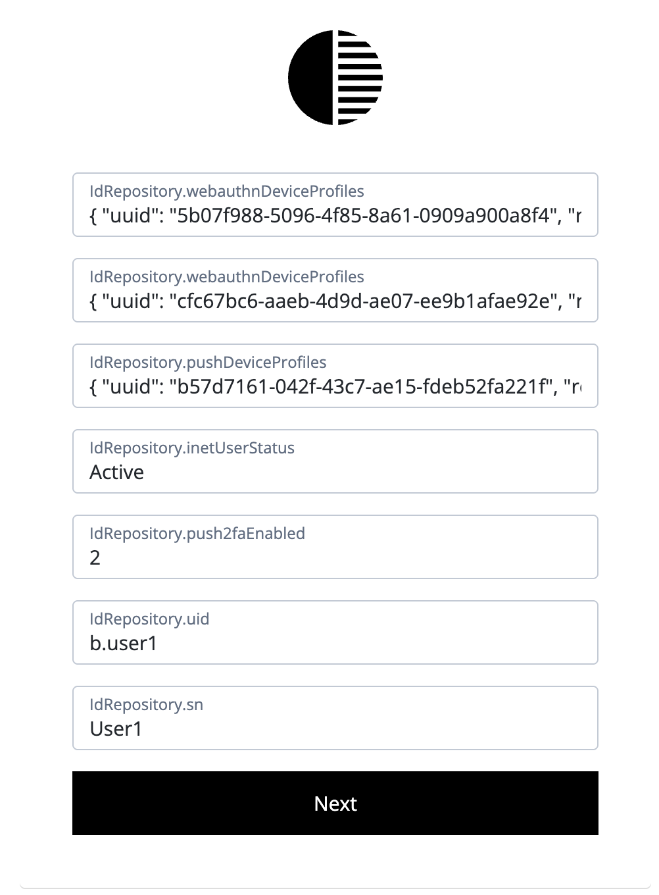

# Display AM attributes

## Introduction

Sample JS scripted that prints AM attributes as they are defined.

## Contents

Example Display

## Configuration

Create an AM scripted decision node using the node in the [src](src) directory

- get-am-attributes.js